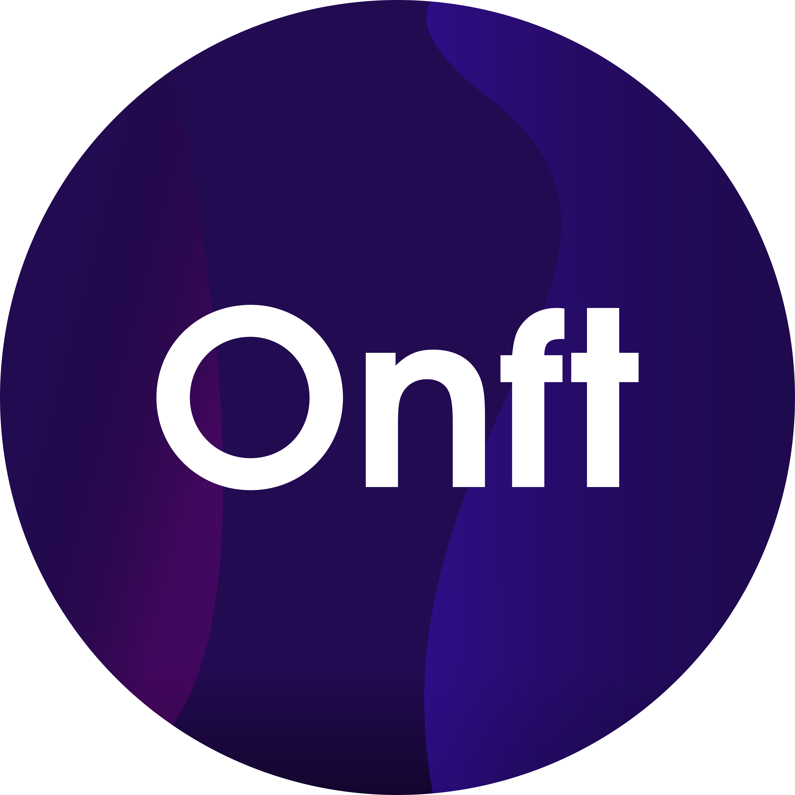

<p align="center">
    <a href="https://github.com/Owez/onft"></a>
</p>
<p align="center">
    <a href="https://crates.io/crates/onft"></a>
    <a href="https://docs.rs/onft/"></a>
</p>
<p align="center">
    Bespoke protocol and high-level implementation of Non-fungible token (NFT) technology 🚀
</p>

## Example

```rust
use onft::Chain;

// create
let mut chain = Chain::default();
println!("Chain: {:?}", chain);

// add block
chain.push_data("Hello, world!").unwrap();
println!("Chain: {:?}", chain);

// verify
if let Ok(true) = chain.verify() {
    println!("Verified")
} else {
    eprintln!("Not verified")
}
```

Check the useful [`examples/`](https://github.com/Owez/onft/tree/master/examples) directory or the item-level documentation for more examples! 😊

## Usage

Simply add the following to your `Cargo.toml` file:

```toml
[dependencies]
onft = "0.1.0-beta.2"
```

## Licensing

This project is dual-licensed under both the [MIT](https://en.wikipedia.org/wiki/MIT_License) and [Apache](https://en.wikipedia.org/wiki/Apache_License) licenses, so feel free to use either at your discretion.
